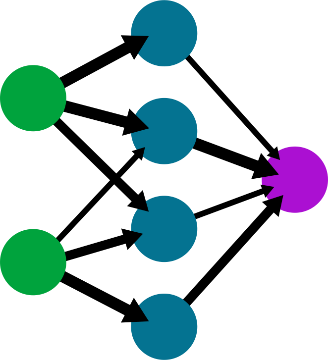

# Neural Network from Scratch with Numpy - MNIST Dataset


This repository contains a Python implementation of a simple neural network built from scratch using only Numpy library. The neural network is trained and tested on the popular MNIST dataset to perform handwritten digit recognition. It achieved an accuracy of 92.2% with a neural network architecture of 2 layers, each having 10 neurons, trained over 100 epochs.

## Table of Contents

- [Introduction](#introduction)
- [Requirements](#requirements)
- [Installation](#installation)
- [Usage](#usage)
- [Results](#results)
- [Customization](#customization)
- [Contributing](#contributing)
- [License](#license)

## Introduction

The MNIST dataset is a widely used benchmark for testing machine learning algorithms. It consists of 28x28 grayscale images of handwritten digits (0-9) along with their corresponding labels. This repository presents a simple neural network implementation using the Numpy library to classify these images accurately.

## Requirements

- Python 3.x
- Numpy

## Installation

Clone the repository to your local machine using the following command:

```bash
git clone https://github.com/your-username/your-repo.git
```

Ensure you have the required libraries installed. If Numpy is not already installed, you can install it using `pip`:

```bash
pip install numpy
```

## Usage

To train and test the neural network on the MNIST dataset, run the main script:

```bash
python mnist_neural_network.py
```

## Neural Network Architecture

The neural network architecture consists of two layers, each having 10 neurons. The hidden layer uses the hyperbolic tangent (tanh) activation function, while the output layer uses the softmax activation function for multiclass classification.

## Results

After training the neural network on the MNIST dataset for 100 epochs, it achieved an accuracy of 92.2% on the test set.

## Customization

You can experiment with different hyperparameters, such as the number of layers, neurons per layer, learning rate (alpha), batch size, and the number of training epochs, to observe their impact on the performance of the neural network on the MNIST dataset.

## Contributing

Contributions to this repository are welcome. If you find any issues or want to suggest improvements, please create a pull request, and we'll be happy to review and merge them.

## License

This project is licensed under the [MIT License](LICENSE).

**Note:** The accuracy obtained by the neural network may vary depending on the hyperparameters chosen and the number of training epochs. This implementation is intended for educational purposes to demonstrate building a simple neural network from scratch using Numpy. For production or serious applications, it is recommended to use deep learning libraries like TensorFlow or PyTorch, which are optimized for efficiency and have a wider range of features and support.
